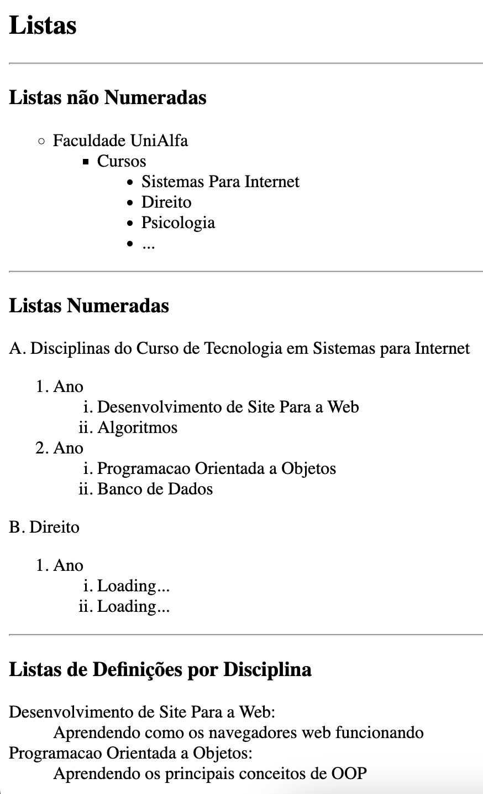
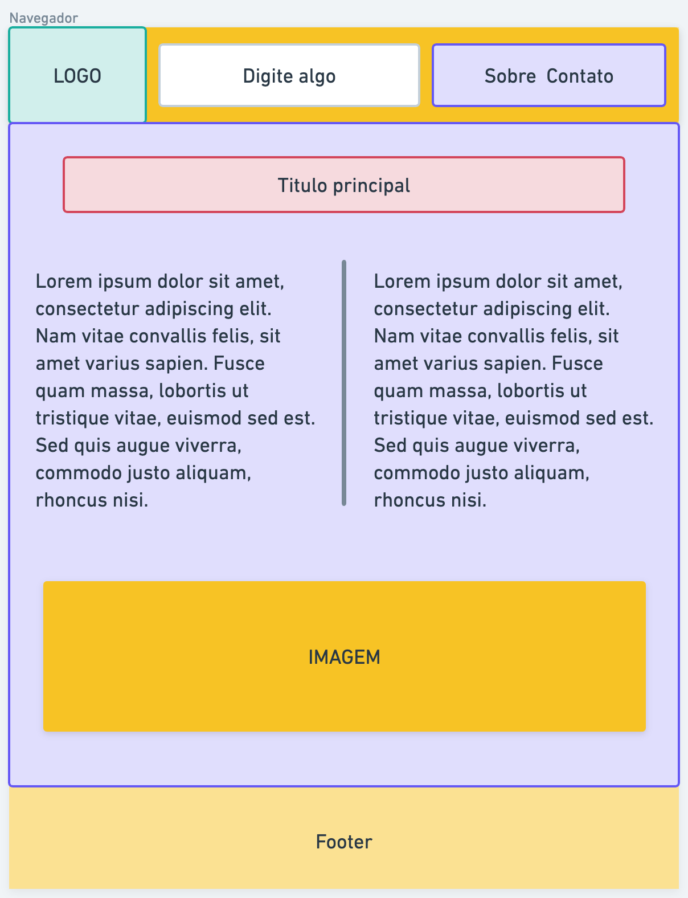
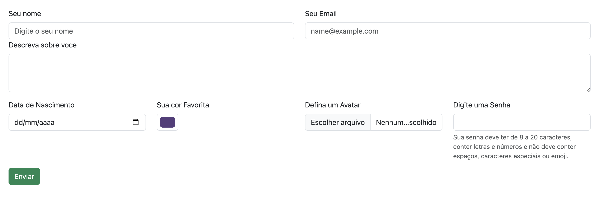
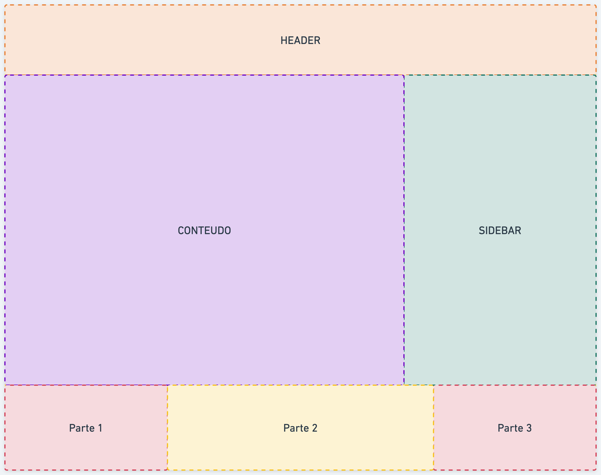
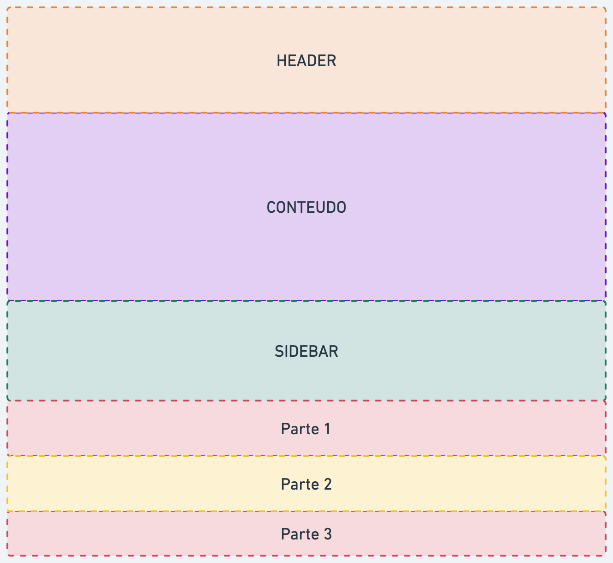

#   Lista de exercícios nível 01
<details>
    <summary>Exercício 01</summary>
    Escreva um HTML contendo um HEADER, MAIN.

    1. Dentro do header deve-se ter uma logo e um nav com alguns links de exemplo.

    2. Estilize com o CSS o HEADER

    3. Dentro do MAIN pratique as tags principais:
        1. IMG
        2. P
        3. A
        4. SECTION
</details>
<br>

<details>
    <summary>Exercício 02</summary>
    Realizar o download do projeto no link a seguir: https://github.com/alexmpereira/projeto-1periodo.

    1. No Header é necessário ajustar para ter a cor de fundo #103FA7, espacamento com padding de 10px e a largura 100%

    2. Os links da navegacao nao estao redirecionando para as suas paginas, configure-as para redirecionar de acordo com o texto de cada menu, por exemplo Quem Somos para o arquivo quem-somos.html

    3. No index.html existe uma lista de filmes, deve ser listado em colunas contendo no máximo 4 colunas

    4. Ainda no arquivo index, dentro das colunas existe um botao de Detalhes, as bordas desse botao de ter um arredondamento de 100%

    5. No index quando clicamos no Botao Detalhes é redirecionado para o arquivo filme.html. Crie arquivos com a mesma. estrutura do filme.html de acordo com os filmes listados das colunas.
</details>
<br>

<details>
    <summary>Exercício 03</summary>
    Realizar o download do projeto no link a seguir: https://github.com/alexmpereira/projeto-1periodo-ex3

    1. No Header, adicionar a cor de fundo #FFCB00 e uma. sombra na parte de baixo com o valor 0 0 20px #333;

    2. Nos links do Menu, ao passar o mouse a cor deve mudar para #F00

    3. Import no head do html uma fonte do site da google fontes (pode ser a fonte Raleway por exemplo) e inclua no CSS para que ela carregue primeiro como fonte principal

    4. Dentro da div que contém a classe container, adicionar um titulo: Veículos em Destaque

    5. Duplique o trecho de grid para ter 3 colunas

    6. Ajuste no CSS para que as colunas fiquem uma ao lado da outra

    7. Em cada coluna na tag img, preencha adicionando a imagem de carros que ficam no diretório imagens

    8. Abaixo da tag img de cada coluna, inclua uma tag strong passando o nome do carro como descricao.

    9. No botao de detalhes, adicione um link para redirecionar para a página de cada carro

    10. A cor do botao de detalhes deve ser #FFCB00

    11. Por volta de cada coluna, para ficar mais elegante, adicione um sombra com o CSS, usando de valor da propriedade: 0 0 20px #999

    12. Crie arquivos HTML com detalhes de cada carro de acordo com os links adicionados no botao Detalhe.

    13. No Menu Contato, carregue o bootstrap e escreva um formulário contendo os seguintes campos: Nome, Email, Telefone, Idade

    14. No Menu de Carros escreva uma página que liste todos os carros do diretório imagens

    15. No Menu de Sobre tente escrever uma página elegante usando divs, h1, listagens e paragrafos

    16. Desenvolva um Footer para o final de cada página, incluindo o seu nome
</details>
<br>

<details>
    <summary>Exercício 04</summary>
    #### Seguindo o exemplo abaixo:
    

    #### Implemente as Tags:

    ```` HTML
    <ul></ul>, <ol></ol>, <li></li>, <dt></dt>, <dd></dd>
    ````
</details>
<br>

5. Desenvolva o HTML e CSS do layout abaixo:
    
6. Desenvolver uma página HTML igual ao formulário abaixo, usando bootstrap:
    > Observacoes importantes:
    1. Parar alinhar os campos um ao lado do outro, usar o grid do bootstrap: https://getbootstrap.com/docs/5.3/layout/grid/
    2. Os campos (inputs) devem ter os tipos corretos.
    
7. Estudar a documentação da w3Schools sobre responsividade: https://www.w3schools.com/css/css_rwd_intro.asp
8. Desenvolver uma página HTML igual a imagem abaixo:
    
    1. O layout dessa página deve ser utilizado o CSS GRID e FLEXBOX.

        **DICA**: A parte do FOOTER (ali deve ser utilizado o flexbox) o restante será em GRID

        **DICA ll**: Propriedades que deve ajudar a montar o layout: **display: grid, grid-template-columns, grid-template-rows, grid-template-areas, grid-area. display: flex, justify-content: space-evenly**.
9. Aprveitando ainda o projeto do exercicio 07, foi visto a necessidade de ajustar o layout para as versões mobile, segue abaixo exemplo de como deve ficar o layout em resoluções menores:
    
    Dica: No CSS para ajustar as grids e o flexbox, deve-se usar **@media(max-width: TAMNHO DAS TELAS) {}**
10. Com base no exercicio 06, escreva um script com Javascript, capaz de capturar os dados digitados no formulário e imprimir no console.log
    1. O console.log é uma função do Javascript, ela imprime o que passarmos dentro da função, é possível visualizar esse log no inspecionar elemento do navegador na aba **Console**.
    2. Na w3Schools tem um exemplo passando o valor para um campo input, no caso faremos o inverso, pegar o valor digitado no input, mas serve como exemplo: https://www.w3schools.com/JSREF/prop_number_value.asp
11. Usando a tag table do HTML crie uma tabela com as seguintes colunas: Nome, Idade, e-mail, Endereço.
    1. Faça a estilização dessa tabela usando o CSS ou use o Bootstrap.
12. Crie uma página HTML que o Footer/Rodapé fique na parte inferir da página
13. Desenvolva um formulário contendo os seguintes inputs: Nome e Email.
    1. Em seguida Estilize com CSS este formulário
    2. Configure o formulário para ao clicar em enviar, chame uma função Javascript.
        Essa função deve capturar os valores dos campos Nome e Email e fazer a seguinte validação:
        Caso o campo Nome OU Email for vazio, chamar a função alert("Preencha todos os campos")
14. Estilize um elemento HTML quando o mouse passa sobre ele
    Pode ser uma div contendo um texto dentro.
15. Utilizando a tag iframe, crie um página HTML que mostre um vídeo do youtube.
    Use o CSS para deixar elegante a página.
16. Em um dos desafios, pegue o HTML e adicione as metas tags para SEO no cabeçalho.